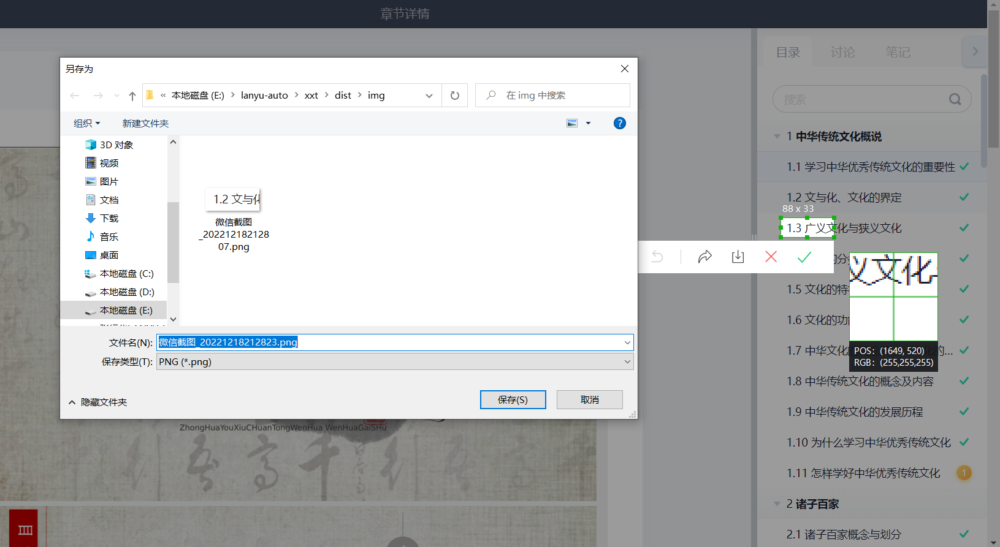
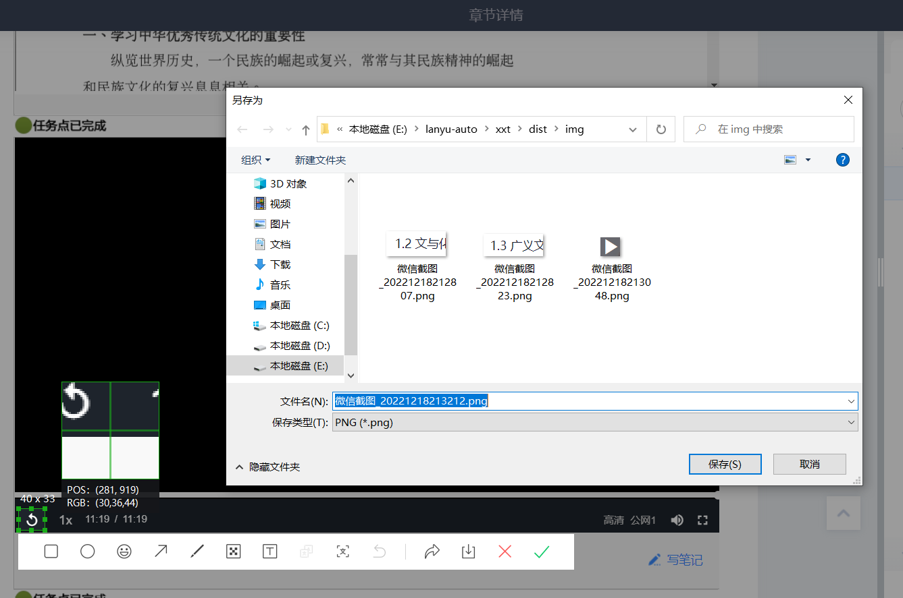

# chaoxingxuexitong
### 超星学习通刷网课视频脚本 [最新版本为v0.0.4点击下载](https://www.aliyundrive.com/s/TXhHqUw8dE1)
### 技术支持与意见反馈请关注微信公众号“geeklanyu”或联系邮箱“silence2021silence@163.com”。
### 免责声明：本程序仅供学习、研究与娱乐使用，使用本程序违反相关法律或相关规章制度的与作者无关，禁止用于任何商业用途。

# 使用说明：
## 1.普通用户
### 如果你不会敲代码，可以[点击这里](https://www.aliyundrive.com/s/TXhHqUw8dE1)直接下载发行版，即.exe可执行文件，下载好后完成相关配置，双击打开即可使用。
## 2.会搞Python的用户
### 会搞Python的兄弟可以下载.py文件然后安装相关的库来跑脚本。
#### 需要用到的库有：
#### pip install pyautogui
#### pip install opencv-python
#### pip install pillow

# 配置步骤：
## 1.创建img文件夹和task.txt文件，并确保与.exe可执行文件在同一目录下，文件夹名和文件名不能错，否则会报错。
### 
## 2.对要刷的章节进行截图采样，保存到img文件夹，注意文件名不能有中文。
### 
## 3.对播放键进行截图采样，保存到img文件夹，注意文件名不能有中文。
### 
## 4.对重播键进行截图采样，保存到img文件夹，注意文件名不能有中文。
### 
## 5.编辑task.txt文件，第1行填写播放键采样截图的文件名，第2行填写重播键采样截图的文件名，第3行及以下填写各章节采样截图的文件名 (必须按章节顺序)。
### 
## 6.打开视频学习页面，双击打开.exe可执行文件，然后最小化程序窗口，即可开始。
### 
